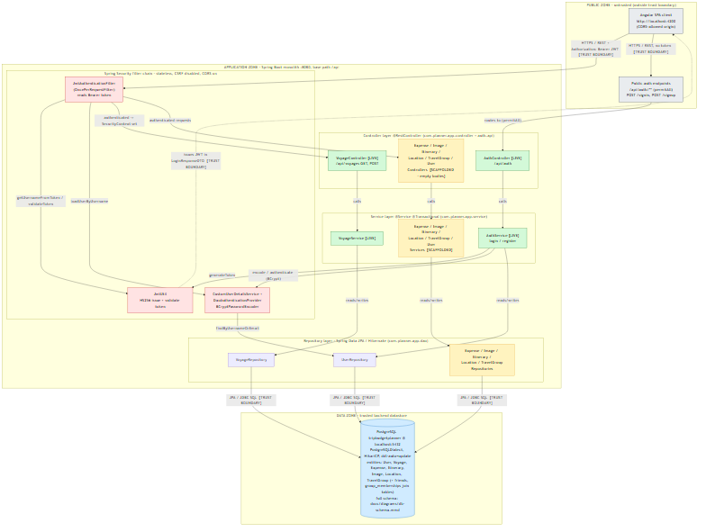

# Architecture

Focused architecture split of `AGENTS.md` for the Budget Trip Planner backend.
It describes the system **as it actually is in the code** - read entry points,
route definitions, the schema, and config to build it. Where a domain is only
scaffolded, that is stated plainly rather than implied to be working.

## System view

Diagram sources (keep both in sync with the code):

- `docs/architecture.mmd` - Mermaid `flowchart TD` (rendered to the PNG above).
- `docs/architecture.drawio` - draw.io / mxGraph mirror of the same diagram.
- `docs/diagrams/db-schema.mmd` - detailed PostgreSQL `erDiagram` (columns,
  constraints, FKs). The system view references it rather than duplicating columns.

## Style

A classic **layered REST monolith**: a single Spring Boot application
(`com.planner.app.Application`, `@SpringBootApplication`) serves REST controllers
under the `/api` base path, delegates to a `@Service` business layer, which
persists through Spring Data JPA repositories to a single **PostgreSQL** database.
There are no microservices, gateway, cache, queue, load balancer, or outbound
third-party integrations - PostgreSQL is the only external system.

## Package structure (`com.planner.app`)

Package-by-type layout:

| Package | Responsibility |
|---|---|
| `auth` | Authentication module: `auth.api.AuthController`, `auth.api.dto`, `auth.jwt.JwtAuthenticationFilter`, `auth.jwt.JwtUtil`. |
| `config` | `SecurityConfig` - Spring Security wiring (filter chain, CORS, encoder, auth provider). |
| `controller` | REST controllers (`@RestController`) for the seven domains. |
| `service` | Business layer (`@Service`), one per domain, plus `AuthService` and `service.api.CustomUserDetailsService`. |
| `dao` | Spring Data JPA repositories (`@Repository extends JpaRepository<Entity, Integer>`), one per domain. |
| `entity` | JPA entities: `Voyage`, `Expense`, `Image`, `Itinerary`, `Location`, `TravelGroup`, `User`. |
| `dto` | Request/response DTOs: `VoyageDTO`, `UserDTO` (plus the auth DTOs under `auth.api.dto`). |

Dependency direction flows **inward and downward**: Controller -> Service ->
Repository -> PostgreSQL. Wiring is constructor-based throughout (Lombok
`@RequiredArgsConstructor`, or an explicit constructor in `LocationService`).

## Request flow

Using the `Voyage` vertical slice (the most complete domain) as the example:

1. `VoyageController` (`@RestController`, `@RequestMapping("/api/voyages")`)
   receives the HTTP request; `createVoyage` accepts a `VoyageDTO`
   (`@RequestBody`) and maps its fields onto a `Voyage` entity before delegating.
2. `VoyageService` (`@Service`, `@Transactional`) holds the business logic
   (`getVoyageById`, `createVoyage`).
3. `VoyageRepository` (`extends JpaRepository<Voyage, Integer>`) performs
   persistence (includes a JPQL `@Query`).
4. Hibernate maps entities to PostgreSQL over JDBC.

DTO mapping exists where DTOs are present (`VoyageDTO`, `UserDTO`); controllers
translate between request bodies and entities, and entities are returned to the
client (e.g. `VoyageController` returns `ResponseEntity<Voyage>`).

## Live vs. scaffolded (honest status)

Only two controllers expose working endpoints today:

- **`AuthController` [LIVE]** - `POST /api/auth/signin`, `POST /api/auth/signup`.
- **`VoyageController` [LIVE]** - `GET /api/voyages/{id}`, `POST /api/voyages`.

The other six domain controllers - `Expense`, `Image`, `Itinerary`, `Location`,
`TravelGroup`, `User` - are **scaffolded stubs**: they are annotated
`@RestController` with a `@RequestMapping` and a constructor-injected service, but
their bodies declare no handler methods. Their services and most of their
repositories likewise have no implemented methods. They are wired and reachable
through the security chain but currently expose no operations. The diagram marks
these `[SCAFFOLDED]` distinctly from the `[LIVE]` components.

## Trust boundaries (stateless JWT)

Security is configured in `config/SecurityConfig.java` and enforced per request by
`auth/jwt/JwtAuthenticationFilter.java`. The architecture has three trust zones:

**Public zone (untrusted).** The Angular SPA client (CORS-allowed origin
`http://localhost:4200`) and the public auth endpoints. `/api/auth/**` is
`permitAll` (plus `OPTIONS /**` for CORS preflight) so clients can obtain a token
without already holding one.

**Application zone (Spring Boot :8080).** Every other request must cross the
Spring Security filter chain first:

- Sessions are `SessionCreationPolicy.STATELESS` - no server-side HTTP session;
  CSRF is disabled (appropriate for a stateless bearer-token API); CORS is enabled.
- `JwtAuthenticationFilter` (`OncePerRequestFilter`) is registered
  `addFilterBefore(..., UsernamePasswordAuthenticationFilter.class)` and is the
  entry gate. It reads `Authorization: Bearer <token>`, extracts the username via
  `JwtUtil.getUsernameFromToken`, loads the user via `CustomUserDetailsService`,
  validates with `JwtUtil.validateToken` (HS256, issuer `planner-app`), and on
  success populates the `SecurityContextHolder`.
- `anyRequest().authenticated()` - everything outside `/api/auth/**` requires a
  valid token.
- Credentials are checked by a `DaoAuthenticationProvider` wired with
  `CustomUserDetailsService` + a `BCryptPasswordEncoder`. JWT issuance happens on
  the auth path: `AuthController` -> `AuthService` -> `JwtUtil`, returning the
  token in `LoginResponseDTO`.
- There are no roles/authorities: authorization is all-or-nothing
  (authenticated vs not).

**Data zone (trusted).** PostgreSQL, reached only by the repository layer over
JPA/JDBC. Repository -> database is the boundary into the data zone.

## Datastore

- **PostgreSQL** database `tripbudgetplanner` at `localhost:5432`, accessed via
  JDBC through Spring Data JPA / Hibernate (`PostgreSQLDialect`, HikariCP pool).
- Schema is entity-driven at runtime via `spring.jpa.hibernate.ddl-auto=update`
  (dev) / `validate` (prod). The SQL files under `src/main/resources/db/` are
  manual reference scripts - **no Flyway/Liquibase is wired in**.
- Main entities: `User`, `Voyage`, `Expense`, `Itinerary`, `Image`, `Location`,
  `TravelGroup`, plus the `friends` and `group_memberships` join tables (mapped as
  `@ManyToMany`, no dedicated entity). See `docs/diagrams/db-schema.mmd` for the
  full column/constraint/FK detail.

## Profiles (dev / prod)

Two profile-specific property files under `src/main/resources`:

- **dev** (`dev/application.properties`): datasource URL/credentials from env vars
  with localhost defaults; `ddl-auto=update`; `show-sql=true`; verbose logging;
  Spring DevTools hot reload enabled.
- **prod** (`prod/application.properties`): `spring.profiles.active=prod`; static
  datasource config; `ddl-auto=validate`; `show-sql=false`; reduced logging; no
  DevTools.
- Common to both: `server.port=8080`; PostgreSQL driver; `PostgreSQLDialect`;
  `jwt.expiration=86400000` (~24h). The JWT secret is read from `jwt.secret` -
  its value is not reproduced here and should be externalized.

## Ports

| Port | Purpose |
|---|---|
| `8080` | Application HTTP (both profiles, `server.port=8080`). |
| `5005` | JDWP remote debug, exposed by the Dockerfile (`EXPOSE 8080 5005`). |
| `5432` | PostgreSQL (datasource URL). |
| `4200` | CORS-allowed Angular front-end origin (not a backend listen port). |

## Build / run

Maven (`pom.xml`, JDK 21) builds the app; Spring Boot is the runtime; the
`Dockerfile` (base `maven:3.9-eclipse-temurin-21-alpine`) runs
`mvn spring-boot:run` with the `dev` profile and a JDWP socket on `*:5005`.
