# budget-trip-planner

A Spring Boot REST backend for planning trips on a budget.

Budget Trip Planner is a REST API for organizing trips (voyages), their expenses, itineraries, travel groups, and related data. Stack one-liner: Java 21 / Spring Boot 3.5.6 / PostgreSQL / JWT.

## Getting Started

### Prerequisites

- JDK 21.
- The bundled Maven Wrapper (`mvnw` / `mvnw.cmd`) — no local Maven install required.
- A running PostgreSQL instance (the app does not provision one).
- Optionally Docker, to run the application in a container.

### Build & test

Use the Maven Wrapper:

```bash
# Linux / macOS
./mvnw clean package          # build + repackage executable jar
./mvnw test                   # run the test suite (JUnit 5 / Spring Boot Test, 18 tests)

# Windows
mvnw.cmd clean package
mvnw.cmd test
```

### Run locally

The `dev` profile is active by default (`activeByDefault=true` in `pom.xml`). The server listens on port `8080`, with the API base path at `http://localhost:8080/api`.

```bash
# Linux / macOS
./mvnw spring-boot:run

# Windows
mvnw.cmd spring-boot:run
```

To run with the `prod` profile explicitly:

```bash
./mvnw -Pprod clean package
# or at runtime:
./mvnw spring-boot:run -Dspring-boot.run.profiles=prod
```

### Run with Docker

The `Dockerfile` builds with the `maven:3.9-eclipse-temurin-21-alpine` base image and launches the application via `mvn spring-boot:run` using the `dev` profile (DevTools hot reload and a JDWP remote-debug socket enabled). It exposes port `8080` (application HTTP) and `5005` (JDWP debug).

This is a dev-mode container. It does **not** start a database — a PostgreSQL instance must be provided separately.

```bash
docker build -t budget-trip-planner .
docker run -p 8080:8080 -p 5005:5005 \
  -e SPRING_DATASOURCE_URL=... \
  -e SPRING_DATASOURCE_USERNAME=... \
  -e SPRING_DATASOURCE_PASSWORD=... \
  budget-trip-planner
```

### Configuration

The `dev` datasource reads the following environment variables (names only — never commit secret values):

- `SPRING_DATASOURCE_URL` (fallback `jdbc:postgresql://localhost:5432/tripbudgetplanner`)
- `SPRING_DATASOURCE_USERNAME` (fallback `postgres`)
- `SPRING_DATASOURCE_PASSWORD`

Two Maven profiles exist: `dev` (default) and `prod`. Each one filters and packages the matching per-environment property folder, `src/main/resources/dev` or `src/main/resources/prod`. Those folders are git-ignored credential folders (under the `### Credentials ###` heading in `.gitignore`); they hold the per-environment `application.properties` (DB credentials, JWT secret) and are intentionally untracked. A fresh checkout will not contain them.

## Documentation

### Stack

| Layer | Technology | Version |
|-------|-----------|---------|
| Language | Java | 21 (`java.version`, `maven.compiler.source/target`) |
| Framework | Spring Boot | 3.5.6 (`spring-boot.version` property) |
| Build | Maven + Maven Wrapper (`mvnw` / `mvnw.cmd`) | Wrapper scripts version 3.3.4; Maven distribution version comes from `.mvn/wrapper/maven-wrapper.properties` (gitignored, not in repo) |
| Build plugin | spring-boot-maven-plugin | 3.5.6 (`${spring-boot.version}`) |
| Build plugin | maven-compiler-plugin | 3.11.0 (pinned, `parameters=true`, source/target 21) |
| Web | spring-boot-starter-web | BOM-governed (3.5.6) |
| Database | PostgreSQL (driver `org.postgresql:postgresql`, `runtime` scope) | BOM-governed |
| ORM | Spring Data JPA / Hibernate (spring-boot-starter-data-jpa) | BOM-governed; dialect `org.hibernate.dialect.PostgreSQLDialect` |
| Auth | Spring Security (spring-boot-starter-security) | BOM-governed |
| Auth (JWT) | com.auth0 java-jwt | 4.4.0 (pinned) |
| Boilerplate | Lombok (`org.projectlombok:lombok`, optional; excluded from repackage) | BOM-governed |
| Dev loop | spring-boot-devtools (`runtime`, optional) | BOM-governed |
| Config metadata | spring-boot-configuration-processor (optional) | BOM-governed |
| Testing | JUnit 5 + Spring Boot Test (spring-boot-starter-test) + Mockito + MockMvc + spring-security-test | BOM-governed (`test` scope) |
| Container | Docker (`maven:3.9-eclipse-temurin-21-alpine` base image) | — |
| License | MIT | (c) 2025 Michel |

### Architecture overview

The application is a single Spring Boot monolith with a classic layered design: REST controllers under `/api/**` delegate to a `@Service` business layer, which persists through Spring Data JPA repositories to a single PostgreSQL database. Dependency injection is constructor-based throughout (mostly via Lombok `@RequiredArgsConstructor`). The intended client is an external Angular SPA (CORS origin `http://localhost:4200`, configured in `SecurityConfig`); no frontend lives in this repository.

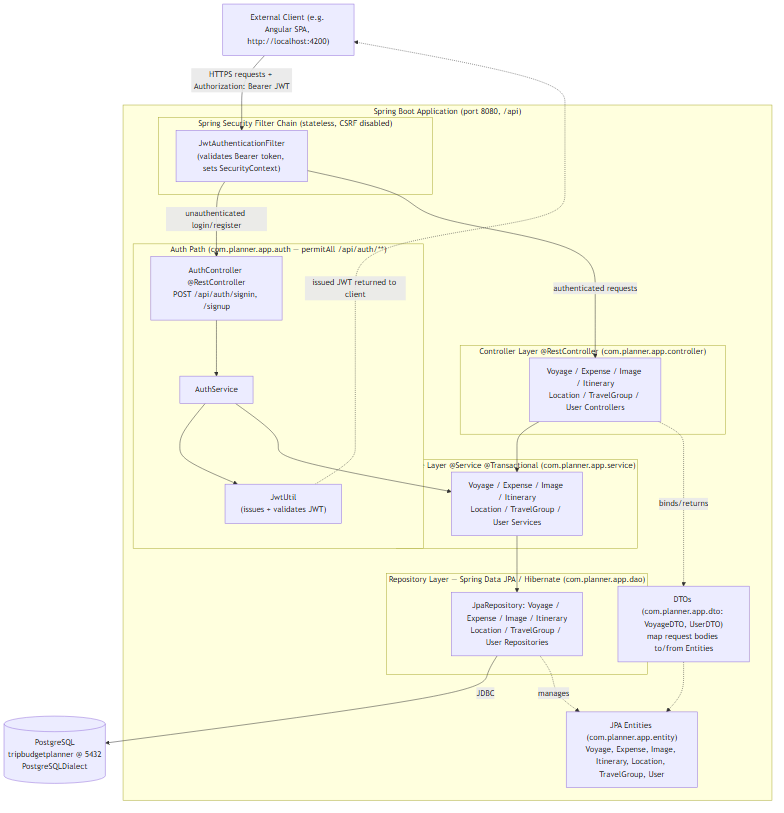

The same system grouped into public / application / data **trust zones** is also maintained as an editable draw.io schema:

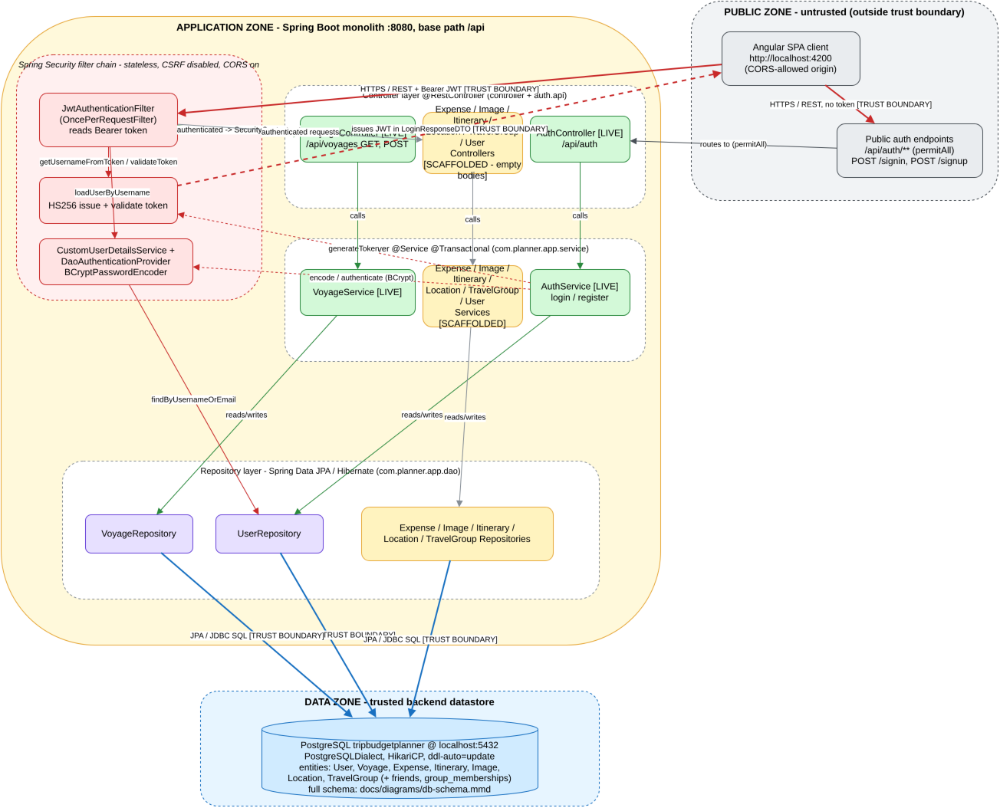

- Editable draw.io schema: [docs/architecture.drawio](./docs/architecture.drawio)
- Mermaid source: [docs/architecture.mmd](./docs/architecture.mmd)

### Database schema

The schema consists of nine tables, including two join tables (`friends` and `group_memberships`), backed by PostgreSQL. The live schema is entity-driven: Spring Data JPA / Hibernate manages it via `spring.jpa.hibernate.ddl-auto=update` (dev) and `validate` (prod). A hand-written `src/main/resources/db/V1__Init_Setup.sql` documents the intended schema and seed data, but no migration tool executes it. The schema also uses polymorphic soft references (`object_type` / `object_id` pairs on `images` and `voyages`) that are not real foreign keys.

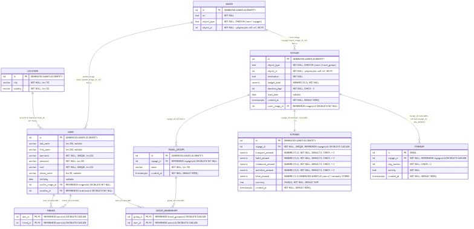

### Database architecture

The application reaches PostgreSQL through Spring Data JPA / Hibernate over the bundled JDBC driver, with connections pooled by HikariCP (Spring Boot's default pool). The target database is `tripbudgetplanner` on port `5432`.

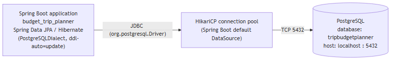

### Authentication flow

Authentication is stateless JWT on top of Spring Security, using the `com.auth0:java-jwt` library (HS256). Passwords are hashed with BCrypt, and login is verified through Spring's `DaoAuthenticationProvider`. The `/api/auth/**` subtree (sign in / sign up) and CORS `OPTIONS` preflight are public; every other route requires a valid `Authorization: Bearer <token>` validated by `JwtAuthenticationFilter`. There is no server-side session and no refresh/logout endpoint — tokens simply expire (24h).

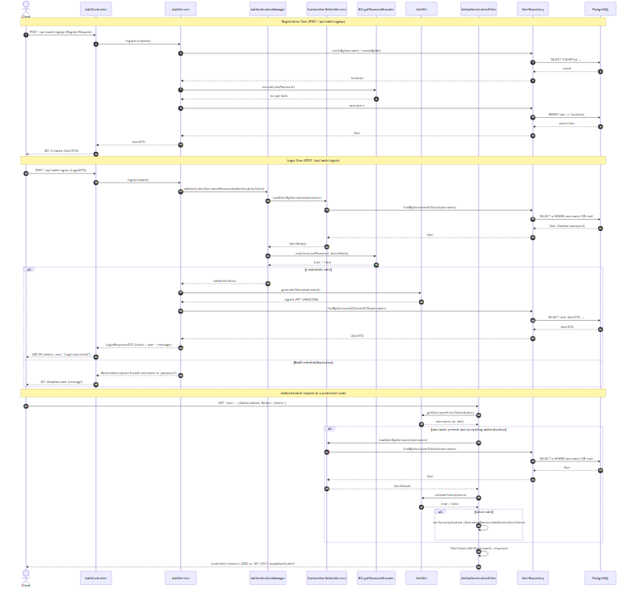

### Main entity lifecycle

This is the Voyage operational CRUD lifecycle, not an internal status state machine. Honestly stated: **no status / state / phase column exists** on any entity. The only live transitions correspond to real `VoyageController` endpoints — create (`POST /api/voyages`) and read (`GET /api/voyages/{id}`); there are no update or delete endpoints. A Voyage can be removed only by a direct DB-level `DELETE`, which cascade-deletes its `expenses` and `itinerary` rows and sets associated `travel_groups.voyage_id` to NULL — this cascade is DB-level only, not an API capability.

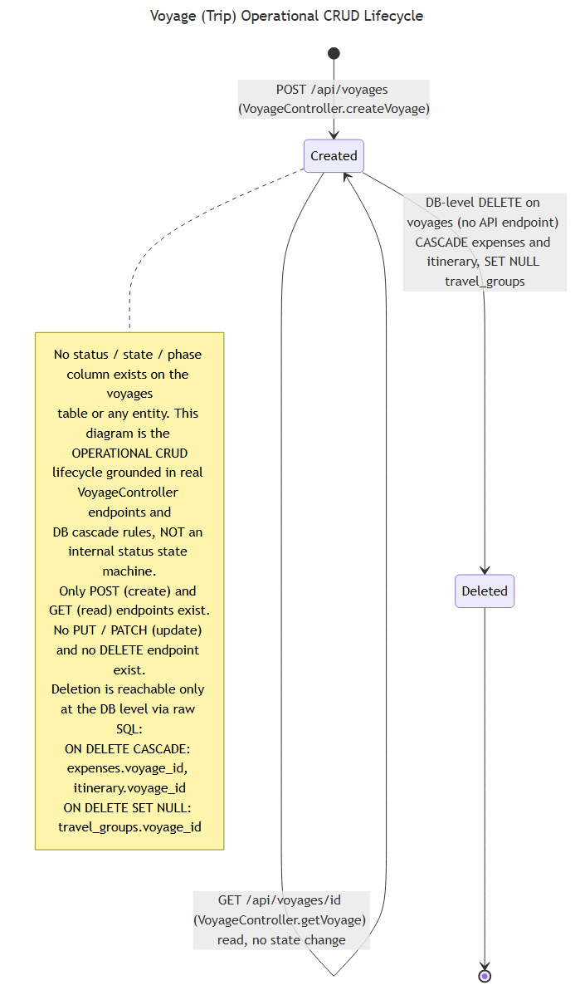

### Backend services

Each domain follows a controller -> service -> repository layering, with all repositories extending Spring Data `JpaRepository<Entity, Integer>`. PostgreSQL is the only external dependency: there is no object storage, message queue, mail, or outbound HTTP integration. Image handling is purely URL-reference based — the `images` table stores a `url` reference rather than any uploaded blob.

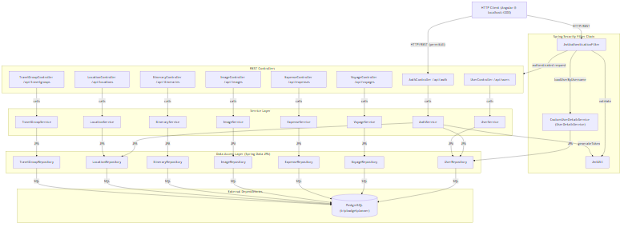

### API overview

The following endpoints are currently live:

| Method | Route | Description | Auth required |
|--------|-------|-------------|---------------|
| POST | `/api/auth/signin` | Authenticate a user; returns a JWT and user info (401 on bad credentials). | No |
| POST | `/api/auth/signup` | Register a new user; returns 201 with the created user (400 on failure). | No |
| GET | `/api/voyages/{id}` | Fetch one voyage by id (200, or 404 if not found). | Yes (JWT) |
| POST | `/api/voyages` | Create a voyage (201, or 400 on failure). | Yes (JWT) |

The other domain controllers (`users`, `expenses`, `itineraries`, `locations`, `travelgroups`, `images`) are scaffolded with class-level base paths but currently declare no method-level mappings, so they expose no endpoints.

### Request lifecycle

An authenticated request enters through `JwtAuthenticationFilter`, which extracts and validates the `Bearer` token and populates the `SecurityContext`. The request then reaches the matching controller, which delegates to its service, which persists through its repository to PostgreSQL. The chain is stateless — no HTTP session is created.

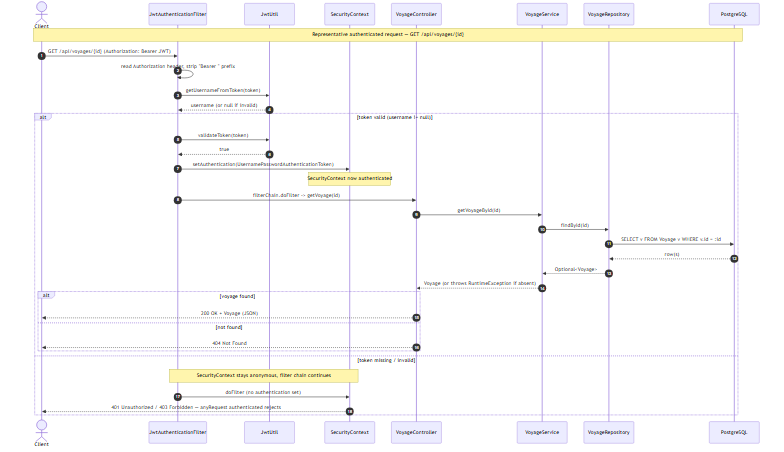

### Testing

The project ships a focused, deterministic test suite under `src/test/java` (18 tests) built on JUnit 5, Spring Boot Test, Mockito, MockMvc, and `spring-security-test`. It runs **without a database**: `JwtUtilTest` and `AuthServiceTest` are pure unit tests, while `AuthControllerTest` and `VoyageControllerTest` use `@WebMvcTest` web-layer slices (public-vs-protected access, the sign-up error body, and JWT-gated voyage routes). Run it with `./mvnw test` (requires JDK 21). Full-context `@SpringBootTest` / DB-integration tests are not yet present. See [TESTING.md](./TESTING.md) for conventions.

### Infrastructure

Deployment is an on-prem / Docker setup: a single dev-mode container (`maven:3.9-eclipse-temurin-21-alpine`) runs the Spring Boot app via `mvn spring-boot:run` on the `dev` profile, exposing ports `8080` (application HTTP) and `5005` (JDWP remote debug). It persists to a separately provided PostgreSQL instance on port `5432`. The runtime fluxes (F1-F6) cover HTTP REST traffic, stateless JWT auth, JDBC persistence, the dev-only JDWP debug socket, secrets/config injection, and the Docker image build & run. No cloud provider, CI/CD pipeline, or external object storage was detected.

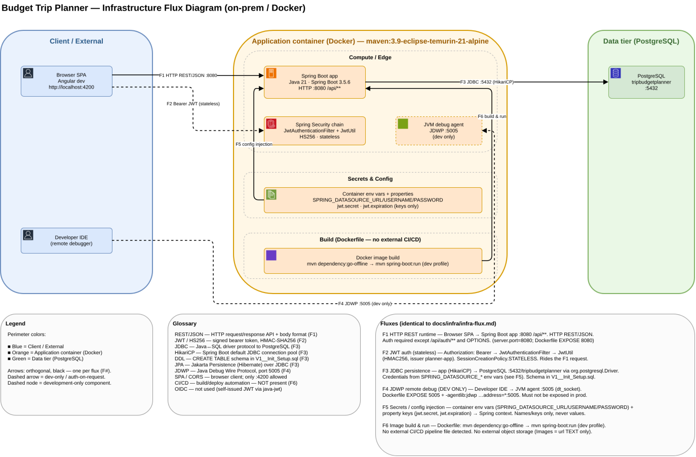

- Single-diagram editable schema: [docs/infra/infra-flux.drawio](./docs/infra/infra-flux.drawio)
- Flux reference (F1-F6 with `file:line` evidence): [docs/infra/infra-flux.md](./docs/infra/infra-flux.md)

#### Flux diagram set (C4 views, editable draw.io)

The same F1-F6 model is also split into a C4-style set of editable draw.io schemas - one master plus three filtered views - kept consistent by stable component IDs and global flux numbers. The Runtime and Ops previews are rendered directly from their `.drawio` files; the Context preview is from its Mermaid mirror.

| View | Preview | Editable schema | Fluxes |
|------|---------|-----------------|--------|
| Context (L0) | 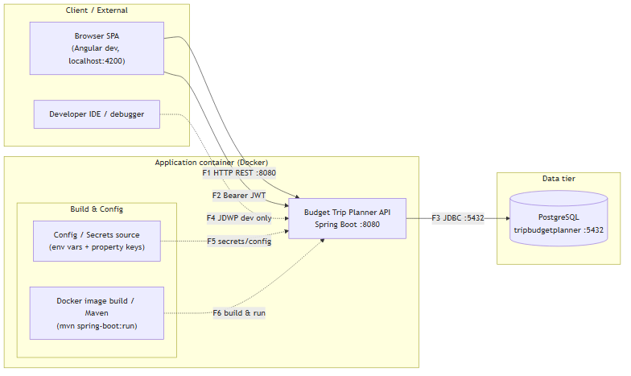 | [context.drawio](./docs/infra/flux/context.drawio) | F1-F6 (top level) |
| Runtime (L1) | 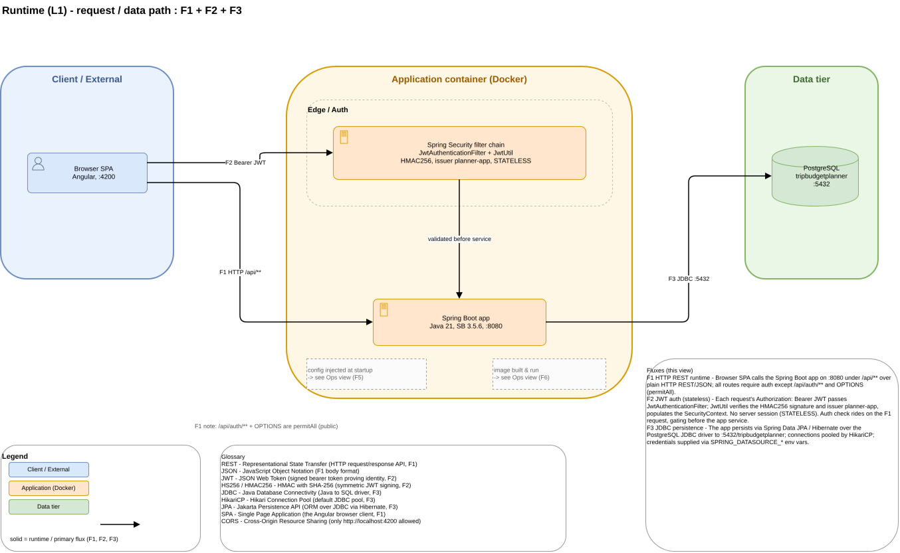 | [runtime.drawio](./docs/infra/flux/runtime.drawio) | F1, F2, F3 |
| Ops / Build (L1) | 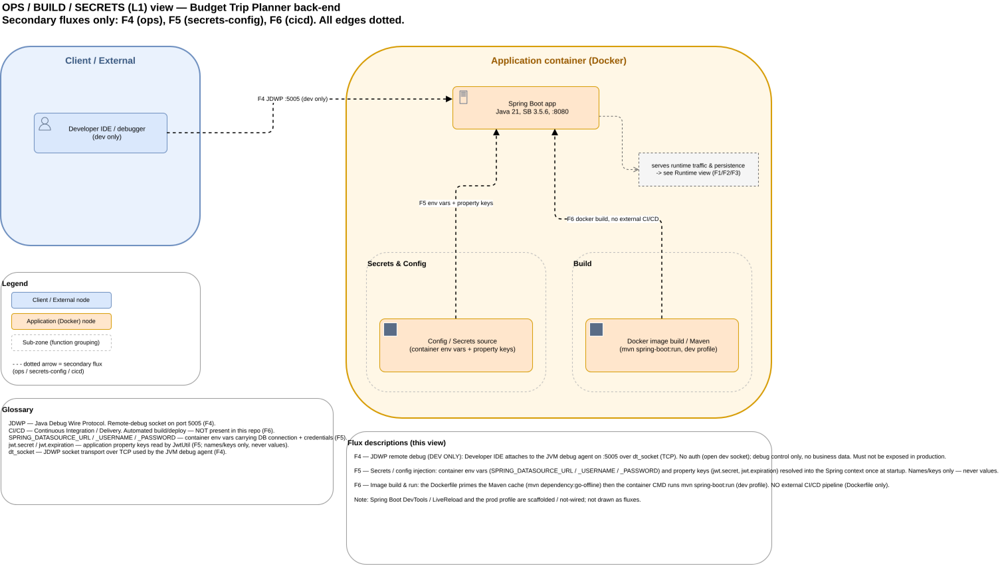 | [ops.drawio](./docs/infra/flux/ops.drawio) | F4, F5, F6 |

- Combined multi-page file (context / runtime / ops as pages): [docs/infra/flux/flux.drawio](./docs/infra/flux/flux.drawio)
- Master flux model + component registry + view index: [docs/infra/flux/flux-model.md](./docs/infra/flux/flux-model.md)

### Key architectural decisions

1. **No `spring-boot-starter-parent`; the BOM is imported via `dependencyManagement`.** Keeps the POM free of an inherited parent so plugins, properties, and packaging are configured explicitly. Tradeoff: loses the parent's preconfigured plugin management, so the Spring Boot and compiler plugin versions must be pinned by hand.

2. **Hibernate `ddl-auto` drives the schema while hand-written SQL exists, with no migration tool.** `update` (dev) lets Hibernate auto-evolve the schema from entities for fast iteration; the `V1__Init_Setup.sql` file documents/seeds the intended schema. Tradeoff: schema-drift risk — the SQL is never executed by a migration tool, and `prod`'s `validate` fails if the DB does not match the entities.

3. **Stateless JWT authentication instead of server-side sessions.** Tokens let the API scale horizontally without a shared session store and suit a SPA/mobile client. Tradeoff: tokens cannot be trivially revoked before expiry, the 24h window has no refresh-token mechanism, and secret-key management matters.

4. **Dev/prod split via Maven profiles + filtered, git-ignored credential folders.** Environment-specific config (DB credentials, JWT secret, logging, `ddl-auto`) is isolated per profile and kept out of version control. Tradeoff: a fresh checkout has no `dev`/`prod` property files, so the build/run is not reproducible without recreating them out-of-band.

5. **Polymorphic associations in the schema instead of typed foreign keys.** A single table can attach to multiple entity types via an `(object_type, object_id)` pair (e.g. an image belongs to either a user or a voyage). Tradeoff: `object_id` cannot be a real foreign key, so referential integrity for those links is not enforced by the database.

6. **Database-computed `STORED` generated column for expense totals.** `expenses.total_amount` is computed and persisted by PostgreSQL from its component amounts, so the total is always consistent. Tradeoff: couples the calculation to PostgreSQL, makes the column read-only from JPA, and can conflict with `ddl-auto`.

### What is not yet documented

- **No frontend in this repository.** This is a backend-only repo; no SPA/web client source exists here.
- **No CI/CD pipeline configuration.** No `.github/workflows`, `.gitlab-ci.yml`, `Jenkinsfile`, or `.circleci/` — build/test/deploy is manual (Maven Wrapper / Docker).
- **Test coverage is focused, not exhaustive.** The suite under `src/test/java` (18 tests) covers `JwtUtil`, `AuthService`, and the auth/voyage web layer via unit and `@WebMvcTest` slices; full-context (`@SpringBootTest`) and DB-integration tests are not yet present (they would need an H2 or Testcontainers datasource).
- **No `docker-compose` / external PostgreSQL provisioning.** The `Dockerfile` runs only the application and does not start a database; PostgreSQL must be provided separately.
- **No migration tooling wired.** A hand-written `V1__Init_Setup.sql` exists (Flyway-style naming) but no Flyway or Liquibase dependency is present and nothing executes it; the schema is governed by Hibernate `ddl-auto`.

## Project guidance

Conventions for working in this repository are documented for both humans and coding agents:

- [AGENTS.md](./AGENTS.md) - complete, self-contained contributor/agent guide (project facts, navigation, conventions, before-finishing checks).
- [ARCHITECTURE.md](./ARCHITECTURE.md) - layered design, trust boundaries, and the diagram index.
- [CLEAN-CODE.md](./CLEAN-CODE.md) - code-quality standards and the conventions observed in this codebase.
- [TESTING.md](./TESTING.md) - testing approach, how to run the suite, and the path to integration tests.

## License

This project is licensed under the MIT License ((c) 2025 Michel).
